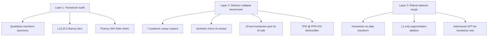

# Agent #12 — DAMAGE Detector + Humanizer Audit

**Topic:** DAMAGE benchmark/framework — methodology, paper, results tables, academic debate  
**Primary paper:** Masrour, Emi & Spero, *DAMAGE: Detecting Adversarially Modified AI Generated Text*, COLING 2025 GenAIDetect workshop  
**Prepared:** 2026-08-19  
**Status:** Complete research memo for unslop detector refresh  
**Cross-refs:** [Agent #40](AGENT-40-DAMAGE-HUMANIZER-TIERS.md) (L1/L2/L3 tier inventory, vendor verification), [Agent #60](AGENT-60-PANGRAM-VS-GPTZERO-PARAPHRASE.md) (Pangram vs GPTZero debate), [Agent #17](AGENT-17-SADASIVAN-IMPOSSIBILITY.md) (TV-distance bound)

---

## Executive summary

**DAMAGE** names three things at once: (1) a **COLING 2025 paper** auditing 19 commercial humanizers/paraphrasers; (2) a **detector architecture** (Mistral NeMo 12B + LoRA, humanizer-augmented training); and (3) the **de facto benchmark protocol** for measuring detector collapse under humanization — TPR @ fixed FPR on academic essays before/after a pooled humanizer pass.

The paper's headline finding is structural, not vendor-specific: **legacy detectors break on humanized text.** GPTZero drops from 99.73% → 60.04% TPR@FPR=5%; Binoculars from 94.15% → 28.23%. A deep-learning classifier trained with ~0.68% humanizer-augmented data (18× oversampled, L1 only) holds 98.26% on the same benchmark. The authors then fine-tune a GPT-4o humanizer against their own detector and still catch 93.2% at default threshold — a partial answer to Nicks et al. (ICLR 2024) that detectors are "easily optimized against."

**What DAMAGE is not:** a semantic-fidelity benchmark. Fluency is measured (GPT-4o Fluency Win Rate); meaning preservation is qualitatively described but never scored. **What it is:** the first peer-reviewed **systematic audit** of the gray-market humanizer ecosystem, with reproducible evaluation splits and ablation evidence that humanizer robustness is a **learned invariance**, not a separate detection domain.

**Academic debate** centers on conflict-of-interest (all three authors are Pangram Labs), independent replication (Chicago Booth confirms GPTZero humanizer fragility; Pangram robustness), and the arms-race pessimists (Sadasivan, AdvPara, StealthRL) who argue any static classifier is eventually breakable. No published formal rebuttal of DAMAGE methodology exists; criticism is indirect via the broader detection-impossibility literature.

**unslop use:** DAMAGE justifies the live detector loop in `detector.py` and the "honest version" README claims — but unslop should cite Table 3 collapse numbers on **legacy** detectors, not Pangram's self-reported robustness, unless reporting both consumer and ensemble layers ([Agent #60 §8](AGENT-60-PANGRAM-VS-GPTZERO-PARAPHRASE.md)).

---

## 1. Paper identity

| Field | Value |
|-------|-------|
| **Title** | DAMAGE: Detecting Adversarially Modified AI Generated Text |
| **Authors** | Elyas Masrour, Bradley Emi, Max Spero |
| **Affiliation** | Pangram Labs, Inc. |
| **Venue** | Proceedings of the 1st Workshop on GenAI Content Detection (GenAIDetect), COLING 2025 |
| **Pages** | 120–133 |
| **arXiv** | [2501.03437](https://arxiv.org/abs/2501.03437) (posted January 2025) |
| **ACL Anthology** | [2025.genaidetect-1.9](https://aclanthology.org/2025.genaidetect-1.9/) |
| **DOI** | [10.48550/arXiv.2501.03437](https://doi.org/10.48550/arxiv.2501.03437) |

**Lineage papers cited as foundation:**

| Prior work | Role in DAMAGE |
|------------|----------------|
| Emi & Spero (2024) [2402.14873](https://arxiv.org/abs/2402.14873) | Synthetic mirror prompts, Pangram classifier baseline |
| Krishna et al. / DIPPER (2023) [2303.13408](https://arxiv.org/abs/2303.13408) | Paraphrase-as-attack; included as L1 tool |
| Nicks et al. (ICLR 2024) [2310.14720](https://arxiv.org/abs/2310.14720) | Fluency Win Rate metric; adversarial optimization frame |
| Dugan et al. / RAID (2024) [2405.07940](https://arxiv.org/abs/2405.07940) | External paraphrase/synonym attack splits (Table 4) |
| Liang et al. (2023) [2304.02819](https://arxiv.org/abs/2304.02819) | ESL bias motivation for evaluation mix |
| Hans et al. / Binoculars (2024) [2401.12070](https://arxiv.org/abs/2401.12070) | Zero-shot baseline in Table 3 |

---

## 2. What DAMAGE measures — framework overview

DAMAGE is best read as a **three-layer evaluation stack**:

### 2.1 Layer 1 — Humanizer audit (§3–4)

**Tool selection (§3.1):** 19 tools chosen by search popularity and academic relevance — 3 paraphrasers (DIPPER, Grammarly, Quillbot) + 16 commercial humanizers. Not a random sample; explicitly the most visible gray-market products.

**Qualitative methodology (§4.1):** Manual review of several samples per tool. Auditors catalog:

- Vocabulary and sentence-structure changes
- Hallucinated citations, inline garbage (`??????`), random tokens
- Structural continuity (synonym-swap vs full paragraph rewrite)
- Writing-level shifts (elementary vs university tone)

**Tier taxonomy (§4.5–4.6):** L1/L2/L3 by **fluency and faithfulness**, explicitly **not** bypass rate. Full per-tool Table 9 inventory → [Agent #40](AGENT-40-DAMAGE-HUMANIZER-TIERS.md).

**Fluency Win Rate:** From Nicks et al. — GPT-4o picks the more fluent/coherent of (original, humanized) on 25 samples per tool. Tier aggregates:

| Tier | Avg Fluency Win Rate |
|------|---------------------|
| L1 | 26.0% |
| L2 | 14.67% |
| L3 | 2.67% |

Lower win rate = humanizer degraded quality more. Even L1 tools usually lose to the original.

**Market observations (§3.2–3.4):** Many humanizers are LLMs with jailbreakable system prompts; two of four top GPT Store "Writing" custom GPTs call external humanizers; humanizers remove SynthID watermarks (Table 2 below).

### 2.2 Layer 2 — Detector collapse benchmark (§5.1, §6)

**Evaluation corpora (Appendix B, Table 6):** Seven held-out academic/student essay datasets totaling ~64k human essays:

| Dataset | Samples | Profile |
|---------|---------|---------|
| PERSUADE 2.0 | 25,996 | 6th–12th grade argumentative |
| PII Detection (Kaggle) | 6,807 | MOOC assignments |
| CommonLit Summaries | 3,897 | 3rd–12th grade |
| ELLIPSE | 3,907 | ELL 8th–12th |
| BAWE | 2,761 | UK undergrad |
| ICNALE | 5,600 | Asian ELL undergrad |
| PELIC | 15,423 | Pitt ELL |

**Synthetic AI side:** One mirror essay per human essay via double-prompt (title extraction → essay generation). Random LLM from a multi-vendor pool (GPT-3.5/4/4o, Claude 2/3, LLaMA 2/3, Mistral, Gemini). Instruction-tuned models only — no base-model outputs.

**Humanization protocol:** AI essays passed through the **full 19-tool pool** (not per-tool breakdown in main tables). Human essays left unmodified for FPR measurement. Metric: **TPR @ FPR=5%** with 1000-iteration bootstrap on the academic benchmark.

**RAID proxy attacks (Table 4):** Paraphrase and synonym subsets from RAID benchmark — broader domain/model mix than the academic essay pool.

### 2.3 Layer 3 — DAMAGE detector recipe (§5.3–5.5)

**Architecture:**

| Component | Choice |
|-----------|--------|
| Base model | Mistral NeMo ~12B |
| Head | Untrained linear classification on final-token hidden state |
| Fine-tuning | LoRA adapters, frozen base |
| Tokenizer | Tekken (multilingual) |
| Context | 512 tokens (cropped) |
| Loss | Weighted cross-entropy |
| Hardware | 8× A100, batch 24, 1 epoch, early stop on validation loss |

**Training data:** Pre-2022 human-written corpora across 10+ domains (reviews, news, email, student writing, ESL, scientific, Gutenberg, Wikipedia) plus synthetic mirrors from modern LLMs.

**Humanizer augmentation (§5.4) — the core methodological claim:**

Humanization is treated as a **transform** the classifier should be **invariant** to, not a new label domain.

1. Source educational prose from FineWeb-EDU; LLM-filter for complete-sentence prose.
2. Create synthetic mirrors; humanize **both** human and AI documents.
3. Chunk to ~300 words.
4. Label humanizer-transformed human text as **human** (not AI) — invariance training.
5. Include **L1 humanizers only** in final model (L2/L3 raise FPR — Table 8 ablation).
6. Volume: ~0.68% of final dataset; **18× oversampling** of humanizer rows.
7. Subscription limits cap per-tool data (basic 1-month tier on each site).

**Post-training:** Hard-negative mining on human false positives (active learning per Emi & Spero 2024); small RAID train subset for model diversity.

**Adversarial humanizer test (§7):** GPT-4o fine-tuned on L1 false negatives from the DAMAGE detector — pairs of (raw AI, successful bypass). Tests whether detector-specific optimization breaks the model without retraining.

---

## 3. Results tables (paper-exact)

### Table 2 — Watermark removal (DIPPER on SynthID)

| Condition | TPR @ FPR=5% | TPR @ FPR=1% |
|-----------|--------------|--------------|
| Watermarked Gemma-2B-IT | 87.6% | 66.5% |
| After DIPPER paraphrase | **5.4%** | **1.5%** |

Humanizers defeat watermarking as well as perplexity detectors. 1000 Gemma-2B-IT samples, ELI5 prompts, temperature 1.0.

### Table 3 — Main detector collapse benchmark (TPR @ FPR=5%, academic essays)

| Detector | Raw AI text | Humanized AI text | Δ (pp) |
|----------|-------------|-------------------|--------|
| GPTZero | 99.73% ± 0.19 | 60.04% ± 1.80 | **−39.7** |
| RADAR | 3.33% ± 0.65 | 5.05% ± 0.81 | +1.7 |
| Binoculars | 94.15% ± 0.88 | 28.23% ± 1.62 | **−65.9** |
| LLM baseline (no humanizer training) | 100.00% ± 0.0 | 95.74% ± 0.71 | −4.3 |
| **DAMAGE detector** | 100.00% ± 0.0 | **98.26% ± 0.47** | **−1.7** |

**Interpretation:** Perplexity-family methods (Binoculars) collapse hardest. A generic LLM classifier without humanizer data retains 95.74% — most of the gain comes from augmentation, not architecture novelty. GPTZero at 60% still beats marketing claims of "99.8% undetectable" on legacy stacks.

### Table 4 — RAID adversarial subsets (TPR @ FPR=5%)

| Detector | Paraphrase | Synonym |
|----------|------------|---------|
| GPTZero | 64.0% | 61.0% |
| RADAR | 62.4% | 62.7% |
| Binoculars | 80.3% | 43.5% |
| LLM baseline | 91.6% | 96.2% |
| **DAMAGE** | **93.0%** | **97.0%** |

### Table 5 — Adversarial humanizer (detector-specific GPT-4o fine-tune)

| Condition | TPR @ FPR=5% | Default TPR |
|-----------|--------------|-------------|
| No humanizer | 100% | 100% |
| Adversarial humanizer | 100% | **93.2%** |

Adversarial humanizer Fluency Win Rate: 14.13% — roughly L2 quality. Some samples bypass at default threshold; fixed-FPR operating point holds.

### Table 7 — Default vendor thresholds (in-the-wild FPR)

| Model | AI TPR (%) | Humanized AI TPR (%) | Default FPR (%) |
|-------|------------|----------------------|-----------------|
| GPTZero | 95.60 | **34.53** | 1.47 |
| RADAR | 70.67 | 79.33 | 51.87 |
| Binoculars | 94.40 | **29.73** | 5.40 |
| LLM baseline | 100.00 | 73.07 | 0.27 |
| **DAMAGE** | 100.00 | **97.47** | 3.40 |

At consumer default thresholds, GPTZero humanized recall is worse than Table 3 (34.53% vs 60.04%) — threshold calibration matters.

### Table 8 — Ablation study (humanizer training design)

| Ablation | AI TPR @ 5% FPR | AI-Humanized TPR @ 5% FPR | FPR @ threshold 0.5 |
|----------|-----------------|---------------------------|---------------------|
| **Final model** (L1, chunked, balanced human+AI humanized) | 100.00% | **98.26%** | 3.47% |
| All humanizers (L1+L2+L3) | 100.00% | 98.92% | **6.00%** |
| Unbalanced (AI-humanized only) | 100.00% | 96.83% | 3.20% |
| Unchunked (full documents) | 100.00% | 96.69% | 3.07% |

**Design lessons:**

- L1-only augmentation trades ~0.7 pp humanized recall for **2.5 pp lower FPR** vs all-tier training.
- Humanizing human documents too (balanced invariance) improves humanized recall vs AI-only augmentation.
- Chunking helps humanized recall (+1.6 pp) with negligible FPR cost.

### Table 9 — Per-tool tier assignments

→ Full inventory in [Agent #40 § Table 9](AGENT-40-DAMAGE-HUMANIZER-TIERS.md). Paper's critical note: tiers rank fluency, **not** evasion. StealthGPT = L1; Undetectable AI = L3.

---

## 4. Methodological strengths and limitations

### 4.1 Strengths

| Strength | Why it matters |
|----------|----------------|
| **First named 19-tool audit** | Gray-market humanizers were understudied; DAMAGE created shared vocabulary (L1/L2/L3) now used across unslop research docs |
| **Held-out academic evaluation** | Seven essay corpora never in training; ESL-heavy mix addresses Liang bias |
| **Fixed-FPR reporting** | Avoids RADAR-style "high TPR because FPR is 52%" trap (Table 7) |
| **Ablation transparency** | Table 8 isolates L1-only, chunking, label-balance choices |
| **Adversarial self-test** | Responds directly to Nicks et al. optimization critique |
| **External RAID validation** | Not only in-house academic essays |

### 4.2 Limitations (internal to paper)

| Limitation | Detail |
|------------|--------|
| **Conflict of interest** | Authors build and sell Pangram; DAMAGE detector ≈ Pangram production pipeline. Competitors (GPTZero, Binoculars) evaluated without disclosed API version lock or joint calibration protocol |
| **Humanizer pool aggregation** | Table 3 collapses 19 tools — no per-tool TPR breakdown in main paper. Pangram blog (Aug 2025) fills this gap but is vendor-operated |
| **No semantic fidelity metric** | Qualitative notes on meaning distortion (L3 citations, nonsense) but no BERTScore, QA-consistency, or human rater study on preservation |
| **Single humanizer pass** | Multi-iteration humanization (Epaphras & Mtenzi 2026 runs up to 5×) not tested |
| **English academic essays only** | Blog posts, code comments, ESL workplace email out of scope |
| **Subscription-capped data** | 0.68% humanizer volume may underrepresent long-tail tool updates |
| **RADAR baseline underperforms** | RADAR at 3.33% TPR suggests miscalibrated comparison or stale checkpoint — weakens "we beat all baselines" if one baseline is broken |
| **Detector not open-sourced** | Reproducibility depends on Pangram API or undisclosed weights |

### 4.3 What DAMAGE does not claim

- That humanizers **preserve meaning** — only that L1 tools preserve fluency better.
- That detection is **permanently solved** — adversarial humanizer still achieves ~7% bypass at default threshold.
- That tiers predict **evasion** — explicitly disclaimed in §4.5.

---

## 5. Academic debate

### 5.1 No formal published rebuttal

As of August 2026, no peer-reviewed paper titled as a DAMAGE critique exists. Debate is **indirect** — framed through adjacent results and COI awareness.

### 5.2 Conflict-of-interest camp

| Actor | Position |
|-------|----------|
| **Skeptical readers** | Pangram authors demonstrating Pangram-class robustness while showing competitor collapse is predictable commercial research, not neutral benchmarking |
| **Practitioner norm** | Cite DAMAGE for **detector-collapse shape** (GPTZero/Binoculars drop) but independently verify Pangram claims via Booth or ensemble academic scorers |
| **GPTZero (Jan 2026)** | [Rebuttal to Chicago Booth](https://gptzero.me/news/chicago-booth-2026/) alleges API field misuse in Booth audit; does **not** re-run DAMAGE 19-tool pool or dispute Binoculars collapse |

**unslop stance:** README and `detector.py` cite DAMAGE for the **20–100 pp marketing gap** and **legacy detector fragility** — defensible. Citing DAMAGE Table 3 DAMAGE row as proof unslop beats humanizers is **not** defensible (different task: unslop subtracts AI-isms, not detector-score optimization).

### 5.3 Independent confirmation

| Study | Relationship to DAMAGE |
|-------|------------------------|
| **Jabarian & Imas / Chicago Booth (NBER w34223, Sept 2025)** | Independent 4-detector audit; StealthGPT (DAMAGE L1) arm. Confirms **GPTZero FNR ~50%+** on humanized text; Pangram robust. Does not replicate 19-tool pool |
| **Russell et al. (ACL 2025)** | Cited on Pangram blog; Pangram Humanizers model vs GPTZero on humanized configs |
| **Epaphras & Mtenzi (2026)** | WriteHuman 1.98% ADR on weak detectors (ZeroGPT/Scribbr) — **conflicts with L3 tier**; panel lacks Pangram/Turnitin. Shows detector-panel choice dominates "bypass" headlines |
| **Turnitin bypasser launch (27 Aug 2025)** | Institutional response to humanizer arms race DAMAGE documented; pre-August bypass numbers stale for Turnitin users |

### 5.4 Arms-race pessimists (DAMAGE as one move, not equilibrium)

| Paper | Challenge to DAMAGE |
|-------|---------------------|
| **Sadasivan et al. (TMLR 2025)** [2303.11156](https://arxiv.org/abs/2303.11156) | TV-distance bound: as LLM and human distributions converge, any detector → coin flip. DAMAGE doesn't refute; shows augmentation helps **today's** humanizers |
| **Nicks et al. (ICLR 2024)** [2310.14720](https://arxiv.org/abs/2310.14720) | "Advise against continued reliance on LLM-generated text detectors." DAMAGE §7 is a partial counter (93.2% post adversarial fine-tune) but uses in-house humanizer, not open adversary |
| **Adversarial Paraphrasing (NeurIPS 2025)** [2506.07001](https://arxiv.org/abs/2506.07001) | ~88% average TPR drop across detectors with query access — stronger threat model than static humanizer paste |
| **StealthRL (2026)** [2602.08934](https://arxiv.org/abs/2602.08934) | RL paraphrase drives mean AUROC 0.79 → 0.43; Binoculars TPR@1%FPR ≈ 0.002 |
| **TempParaphraser** | Fast-DetectGPT 98.9% → 2.6% on HC3 |

**Synthesis:** DAMAGE establishes that **humanizer-aware training** beats perplexity baselines on **2024–2025 commercial humanizer outputs**. It does not establish durable detection under **adaptive adversaries** with API access and continuous retraining — the StealthRL/AdvPara threat model.

### 5.5 Fluency paradox (detection vs quality)

Pangram's August 2025 blog ([humanizers-aug-25](https://www.pangram.com/blog/humanizers-aug-25)) and DAMAGE §4 together support a counterintuitive claim repeated in [Agent #25](AGENT-25-ADVERSARIAL-PARAPHRASING.md):

> **Fluent L1 rewrites can be easier to detect** than garbled L3 output once the detector trains on L1 — generator-family residuals survive fluent paraphrase; nonsense triggers ESL-like false-positive risk.

This splits the academic debate from the student cheat's UX: **quality humanizers ≠ best evaders** once detectors adapt.

### 5.6 Semantic fidelity gap (unslop-relevant)

DAMAGE audits **detector** robustness, not **reader** satisfaction. Community and Cat 15 synthesis note:

- L3 tools destroy meaning but may evade **weak** detectors (Epaphras WriteHuman result).
- L1 tools preserve fluency but leave detectable patterns in adapted classifiers.
- **No published DAMAGE follow-up** quantifies meaning preservation across tiers — Jemama / fidelity-perplexity tradeoff ([Agent #50](AGENT-50-JEMAMA-FIDELITY-PERPLEXITY.md)) fills adjacent space.

unslop's `evals/perceived_humanness.py` explicitly mirrors DAMAGE's Fluency Win Rate methodology while adding counterbalanced LLM-as-judge — a gap DAMAGE left open.

---

## 6. DAMAGE vs related benchmarks

| Benchmark | DAMAGE relationship |
|-----------|---------------------|
| **RAID** | DAMAGE uses paraphrase/synonym splits (Table 4); humanizer pool is **broader** than RAID attacks |
| **MGTBench / TH-Bench** | Academic humanization attacks; no commercial tool names |
| **HumanizerBench (2026)** | Vendor-operated 12-tool monthly cycle; not peer-reviewed; conflated with Booth in README — see [Agent #40 attribution correction](AGENT-40-DAMAGE-HUMANIZER-TIERS.md) |
| **MAGE** | Includes Binoculars; no commercial humanizer tier taxonomy |
| **Poignant Guide 2025 survey** | Practitioner bypass percentages; cites DAMAGE as anchor |

DAMAGE's unique contribution is the **commercial tool naming + fluency tier + detector-collapse protocol** bundle. Later benchmarks either add tools without tiers or tiers without peer review.

---

## 7. Implications for unslop

### 7.1 What to cite DAMAGE for

| Claim | Source | Safe? |
|-------|--------|-------|
| GPTZero/Binoculars collapse on humanized academic text | Table 3 | ✅ |
| Humanizer robustness requires augmentation, not perplexity alone | §5.4, Table 8 | ✅ |
| Vendor "99.8% undetectable" vs independent measurement gap | Table 3 + marketing contrast | ✅ (qualitative range) |
| L1/L2/L3 fluency taxonomy | Table 9 | ✅ (cross-ref Agent #40) |
| Pangram catches 90–100% of named humanizers post-retraining | Pangram blog Aug 2025 | ⚠️ Vendor-operated; date-stamp |
| unslop beats commercial humanizers | — | ❌ Not in DAMAGE scope |

### 7.2 Codebase touchpoints

| Artifact | DAMAGE role |
|----------|-------------|
| `unslop/scripts/detector.py` | Module docstring cites DAMAGE as justification for live feedback loop; cites Nicks as "signal not gate" |
| `evals/perceived_humanness.py` | Mirrors Fluency Win Rate; extends with counterbalanced judges |
| `README.md` | "Honest version" section — DAMAGE + Epaphras + monthly drift |
| `.github/workflows/weekly-detector-bench.yml` | Arms-race monitoring; DAMAGE as motivation |
| `docs/RESEARCH_AND_TECH.md` | DAMAGE row in detection table |

### 7.3 Recommended unslop benchmark protocol (derived from DAMAGE)

1. **Fixtures:** ≥3 academic-essay-length prose samples from `benchmarks/` or PERSUADE-style held-out text.
2. **Humanizer arms:** Name tool + tier if using commercial humanizer; prefer cross-model second pass as unslop-native arm.
3. **Metrics:** TPR@FPR=5% is DAMAGE standard; also report default-threshold consumer scores (GPTZero + Pangram dual-report per [Agent #60 §8](AGENT-60-PANGRAM-VS-GPTZERO-PARAPHRASE.md)).
4. **Ensemble:** TMR loop + Fast-DetectGPT + DivEye surprisal — DAMAGE row is citation anchor, not live scorer.
5. **Fluency:** Run `evals/perceived_humanness.py` when detector scores saturate — DAMAGE doesn't, unslop should.

### 7.4 Anti-detector mode boundaries (from DAMAGE + Nicks + Sadasivan)

DAMAGE strengthens the case that **detector-score optimization alone fails** on legacy stacks but **loses to adapted classifiers**. unslop anti-detector mode remains:

- **For:** ESL false-positive defense, resume polish, voice naturalization
- **Not for:** Beating Pangram/Turnitin post-2025 humanizer training
- **Honest lever:** Cross-model paraphrase + manual edit ([Agent #35](AGENT-35-CROSS-MODEL-PARAPHRASE.md)) — the attack class DAMAGE augments against, not the student paste-box workflow

---

## 8. Open questions (August 2026)

1. **Will Pangram open-source DAMAGE weights or evaluation scripts?** Reproducibility gap persists.
2. **Per-tool Table 3 breakdown in peer review?** Only vendor blog publishes per-humanizer detection %.
3. **Multi-pass humanization:** Does 3× StealthGPT cross the 93.2% adversarial threshold?
4. **Meaning metrics:** Will GenAIDetect 2026 workshop add semantic-fidelity benchmarks DAMAGE omitted?
5. **Turnitin vs DAMAGE pool:** Overlap of "19 tools" with Turnitin bypasser training set undisclosed.
6. **GPTZero v6+ predictability cones:** Does post-DAMAGE GPTZero retraining close the 40 pp gap on the **same** essay pool?

---

## 9. Primary source URLs

| Resource | URL |
|----------|-----|
| DAMAGE arXiv | https://arxiv.org/abs/2501.03437 |
| DAMAGE HTML | https://arxiv.org/html/2501.03437 |
| ACL Anthology | https://aclanthology.org/2025.genaidetect-1.9/ |
| Pangram technical report | https://arxiv.org/abs/2402.14873 |
| Pangram humanizers Aug 2025 | https://www.pangram.com/blog/humanizers-aug-25 |
| Chicago Booth / NBER w34223 | https://doi.org/10.3386/w34223 |
| Nicks et al. ICLR 2024 | https://arxiv.org/abs/2310.14720 |
| Sadasivan TMLR 2025 | https://arxiv.org/abs/2303.11156 |
| RAID benchmark | https://raid-bench.xyz/ |
| Epaphras & Mtenzi 2026 | https://doi.org/10.37284/ijar.9.1.4683 |

---

## 10. Verdict

DAMAGE is the **anchor paper** for the 2025–2026 detector–humanizer arms race in academic integrity research. Its methodology — qualitative tool audit, fluency tiers, fixed-FPR collapse benchmark, humanizer-as-invariance training, adversarial self-test — is sound enough to cite but **vendor-colored** on the solution side. The debate is not "is DAMAGE wrong?" but "how fast does the Sadasivan/Nicks threat model erode DAMAGE's augmentation advantage?"

For unslop: treat DAMAGE as **evidence that detector loops matter and marketing lies**, not as **evidence that unslop's deterministic pass evades adapted detectors**. Cross-ref [Agent #40](AGENT-40-DAMAGE-HUMANIZER-TIERS.md) for tier-level commercial detail; refresh Table 3 numbers quarterly as GPTZero and Pangram ship new model dates.

---

*Agent #12 complete. Cross-refs: Agent #06 (Binoculars collapse), Agent #17 (Sadasivan), Agent #25 (AdvPara), Agent #26 (StealthRL), Agent #40 (tiers), Agent #50 (fidelity), Agent #60 (Pangram vs GPTZero), UPDATE-PLAN-2026-08.md.*
