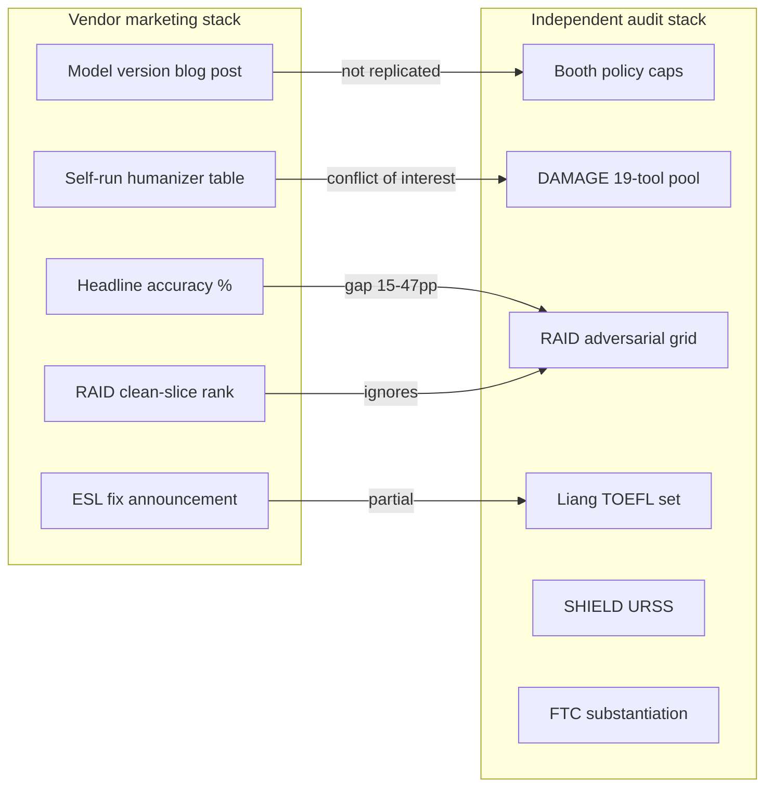

# Agent #67 — Commercial Detector Marketing vs Independent Audit

**Topic:** The gap between vendor accuracy claims and independent benchmarks — Booth, DAMAGE, RAID, SHIELD, Liang, FTC enforcement, and what unslop should cite  
**Prepared:** 2026-08-19  
**Status:** Complete research memo for unslop detector refresh, README honesty pass, and anti-detector boundaries  
**Cross-refs:** [Agent #62](AGENT-62-CHICAGO-BOOTH-2026.md), [Agent #12](AGENT-12-DAMAGE-DETECTOR.md), [Agent #15](AGENT-15-RAID-BENCHMARK.md), [Agent #16](AGENT-16-SHIELD-BENCHMARK.md), [Agent #18](AGENT-18-LIANG-ESL-BIAS.md), [Agent #17](AGENT-17-SADASIVAN-IMPOSSIBILITY.md), [Agent #56](AGENT-56-TURNITIN-2025-2026.md), [Agent #57](AGENT-57-GPTZERO-EVOLUTION.md), [Agent #58](AGENT-58-ORIGINALITY-AI-ALLOWANCE.md), [Agent #59](AGENT-59-COPYLEAKS-V9.md), [Agent #60](AGENT-60-PANGRAM-VS-GPTZERO-PARAPHRASE.md)

---

## Executive summary

Commercial AI-text detectors sell **single headline numbers** — "99% accurate," "98% confidence," "0.2% false positives," "RAID #1" — that almost always describe **clean, raw, medium-to-long English** under **vendor-controlled or vendor-friendly test conditions**. Independent audits repeatedly show **15–47 percentage-point collapses** once text is paraphrased, humanized, shortened, mixed human/AI, or written by non-native English speakers.

The gap is not random noise. It follows a stable pattern:

| Claim type | Typical marketing condition | What independent audits test | Typical gap |
|------------|----------------------------|------------------------------|-------------|
| **Overall accuracy** | Raw AI vs clean human, matched length | Mixed authorship, edited drafts, stubs | 15–47 pp |
| **False-positive rate** | Native English, long passages | ESL TOEFL essays, short stubs | 0.5% claimed → 5–61% measured |
| **Humanizer resistance** | Named tools on vendor-retrained model | 19-tool pool (DAMAGE), StealthGPT (Booth) | GPTZero 99.7% → 60% (DAMAGE); 44–77% FNR (Booth) |
| **Benchmark rank** | RAID clean split or self-run eval | RAID adversarial arms, SHIELD URSS | "99% TPR" → 20–50% under paraphrase |
| **Regulatory accuracy** | Unsubstantiated headline | FTC independent retest | **98.3% claimed → 53.2% measured** (Content at Scale) |

**Three audit tiers** now define the honest landscape:

1. **Independent academic** — Jabarian & Imas (Chicago Booth / BFI WP 2025-116): no vendor funding; 4 detectors; 1 humanizer; policy-cap framework.
2. **Peer-reviewed vendor-adjacent** — DAMAGE (COLING 2025): Pangram authors; 19 humanizers; detector-collapse tables; conflict-of-interest acknowledged.
3. **Open research harnesses** — RAID (ACL 2024), SHIELD (arXiv 2025), MGTBench/TH-Bench: no commercial stake; expose decoding/paraphrase/hardness axes vendors omit from landing pages.

**Regulatory floor (2025):** FTC finalized an order against Workado LLC (Content at Scale / BrandWell) for advertising **98.3% accuracy** when internal tests showed **74.5% mixed** and **53.2% non-academic** — "no better than a coin toss" on general content. First binding precedent that AI-detector efficacy claims require competent substantiation.

**unslop verdict:** Never repeat vendor headline accuracy in README, SKILL.md, or bench reports without naming **corpus, attack arm, metric, and FPR cap**. Cite Booth for policy-cap institutional framing; DAMAGE for multi-humanizer collapse; RAID for why TPR@FPR=5% replaced "99% accurate"; Liang for anti-detector ethical boundaries. Treat Pangram's Booth leadership and GPTZero's clean-text rebuttal as **conditional truths** — both break or invert under humanizer stress. unslop is a **distribution-shaping** tool (Sadasivan TV-reduction), not a detector-defeat product.

---

## 1. Why the gap exists — structural causes

### 1.1 Metric laundering

Vendors conflate incompatible statistics on the same landing page:

- **AUROC** (ranking quality, threshold-free) vs **accuracy at 0.5 threshold** vs **TPR @ FPR=5%** (deployment operating point).
- **Document-level** FPR vs **sentence-level** highlight error (~4% for Turnitin per vendor FAQ).
- **Recall on AI-only corpus** vs **accuracy on mixed human+AI submissions** (what instructors actually receive).

RAID ([Agent #15](AGENT-15-RAID-BENCHMARK.md)) institutionalized **TPR @ FPR=5%** precisely because headline "accuracy" hid catastrophic false-positive tradeoffs. SHIELD ([Agent #16](AGENT-16-SHIELD-BENCHMARK.md)) adds **URSS** — identical AUROC can mask threshold instability across domains.

### 1.2 Condition cherry-picking

Marketing tests optimize for separability:

| Dimension | Marketing default | Audit default |
|-----------|-------------------|---------------|
| Text state | Raw model output | Paraphrased / humanized / mixed |
| Length | 250+ words | Stubs <50 words |
| Language | Native English academic | ESL, multilingual |
| Model age | Current flagship | Cross-model generalization |
| Decoding | Greedy or vendor-default | Repetition penalty, sampling |
| Threshold | Youden's J or vendor-tuned | Fixed FPR cap (0.5%, 1%, 5%) |

Turnitin's **98% / <1% FPR** applies only when **>20% of the document** is already flagged AI — and the CPO admitted **~85% recall** (letting ~15% through) to keep FPR low ([BestColleges 2023 interview](https://www.bestcolleges.com/news/analysis/testing-turnitin-new-ai-detector/)).

### 1.3 Self-benchmarking and moving targets

- **GPTZero** disputes Booth's API field choice, re-runs clean text with Dec 2025 model, claims #1 — but **does not re-run the StealthGPT humanizer arm** ([Agent #62](AGENT-62-CHICAGO-BOOTH-2026.md)).
- **Originality.ai** publishes RAID blog posts ranking itself #1 on paraphrase — using conditions RAID authors warn differ from full adversarial grid.
- **Pangram** cites Booth independently while publishing DAMAGE (same lab) showing competitor collapse — methodologically sound but not neutral.
- **Copyleaks** maps a 4-class LLM-attribution paper to "three investigators" production marketing; binary human/AI fusion weights stay closed ([Agent #59](AGENT-59-COPYLEAKS-V9.md)).
- **HumanizerBench** (WriteHuman-operated) and vendor "bypass %" posts are **adversarial marketing** — rank humanizers using detector panels the operator chooses.

Auto-updating SaaS means any independent number **ages in weeks**. Booth API calls: Aug 2025. GPTZero rebuttal model: `2025-12-18-base`. Turnitin bypasser layer: Aug 2025. Originality Turbo 3.0.2: Sep 2025.

### 1.4 Impossibility bound (why perfect claims are suspect)

Sadasivan et al. ([Agent #17](AGENT-17-SADASIVAN-IMPOSSIBILITY.md)): AUROC ceiling = f(TV distance between human and machine distributions). Paraphrase shrinks TV. **90% TPR @ 1% FPR** becomes impossible when overlap exceeds ~11%. Any vendor claiming near-perfect performance **and** paraphrase robustness **and** near-zero FPR on all populations is claiming to beat a theorem — demand the operating-point tables.

---

## 2. Independent audit ecosystem — what each benchmark actually measures

### 2.1 Chicago Booth (Jabarian & Imas 2025) — gold standard for commercial comparison

| Field | Value |
|-------|-------|
| **Paper** | *Artificial Writing and Automated Detection*, BFI WP 2025-116 / [NBER w34223](https://doi.org/10.3386/w34223) |
| **Independence** | No vendor funding disclosed; Booth CAAI + BFI + Google Cloud Research |
| **Corpus** | 1,992 pre-2020 human × 4 LLMs × 6 genres; matched length/readability |
| **Detectors** | Pangram, GPTZero, Originality.ai, RoBERTa |
| **Humanizers** | **One:** StealthGPT |
| **Novel metric** | **Policy caps** — max FPR (e.g. 0.5%) then report FNR |

**Clean-text headline:** Commercial detectors work; Pangram only tool meeting FPR ≤ 0.5% without sacrificing recall; RoBERTa unusable (30–69% FPR).

**Humanizer headline:** Ranking **inverts**. Pangram FNR ~0–5%; GPTZero FNR **44–77%** by genre/model; Originality degrades on short passages.

**Marketing vs audit gap (GPTZero example):**

| Source | Condition | GPTZero headline |
|--------|-----------|------------------|
| GPTZero marketing (2026) | Self-benchmark, clean text | 99.3% recall, 0.05% FPR |
| Booth (Aug 2025 API) | Clean text, `average_generated_prob` | Strong but below Pangram on policy caps |
| Booth (StealthGPT arm) | Humanized | FNR ~50%+ |
| GPTZero rebuttal (Jan 2026) | Clean text, `predicted_class` | Claims #1 — **humanizer arm not re-run** |

Full tables → [Agent #62](AGENT-62-CHICAGO-BOOTH-2026.md).

### 2.2 DAMAGE (COLING 2025) — humanizer-collapse specialist

| Field | Value |
|-------|-------|
| **Paper** | Masrour, Emi & Spero, [arXiv:2501.03437](https://arxiv.org/abs/2501.03437) |
| **Independence** | **Low** — all authors Pangram Labs; no formal rebuttal of methodology |
| **Corpus** | ~64k human academic essays; synthetic mirrors; **19-tool humanizer pool** |
| **Metric** | TPR @ FPR=5% before/after humanization |

**Table 3 — detector collapse (marketing vs audit gap distilled):**

| Detector | Raw AI TPR | Humanized TPR | Δ (pp) |
|----------|------------|---------------|--------|
| GPTZero | 99.73% | **60.04%** | **−39.7** |
| Binoculars | 94.15% | **28.23%** | −65.9 |
| DAMAGE (Pangram) | 100.00% | **98.26%** | −1.7 |

At **default vendor thresholds** (Table 7): GPTZero humanized TPR = **34.53%** — while marketing pages still cite 99%+ on "AI content."

**Replication value:** Chicago Booth StealthGPT arm **confirms GPTZero fragility** on a different corpus with independent authors. Pangram robustness **not independently replicated** on 19-tool pool — only Pangram-authored DAMAGE.

Full analysis → [Agent #12](AGENT-12-DAMAGE-DETECTOR.md), [Agent #60](AGENT-60-PANGRAM-VS-GPTZERO-PARAPHRASE.md).

### 2.3 RAID (ACL 2024) — ended "99% accurate" era

| Field | Value |
|-------|-------|
| **Paper** | Dugan et al., [arXiv:2405.07940](https://arxiv.org/abs/2405.07940) |
| **Scale** | 6.2M+ generations; 11 LLMs; 8 domains; 4 decoding strategies; 11 attacks |
| **Metric** | **TPR @ FPR=5%** |

**What RAID broke:** Off-the-shelf detectors at TPR@FPR=5%: repetition penalty alone **−38 pp**; synonym swap **−36.1 pp** (Binoculars); homoglyph **−75.7 pp** (Originality). Vendors who cite "RAID #1" usually cite **clean non-adversarial slices** or **post-RAID-training** shared-task models (COLING 2025 Task 3: 99.3% with full train-set knowledge — explicitly **not** claimed to generalize to unseen humanizers).

**Marketing abuse pattern:** Originality.ai blog: "96.7% on paraphrase" — true on RAID T5 paraphrase subset; **not** equivalent to Undetectable.ai / StealthRL / cross-model rewrite.

Full analysis → [Agent #15](AGENT-15-RAID-BENCHMARK.md).

### 2.4 SHIELD (arXiv 2025) — AUROC skepticism

| Field | Value |
|-------|-------|
| **Paper** | Ayoobi, Shahriar, Mukherjee, [arXiv:2507.15286](https://arxiv.org/abs/2507.15286) |
| **Focus** | Hardness ladder (RMM / AWS / RHL); **URSS** metric |
| **Headline** | Zero-shot detectors lose **~80% URSS** under random meaning-preserving mutation |

Vendors reporting AUROC ≥0.99 on clean RAID splits can still **fail deployment** when thresholds shift across domains (SFD collapse). No commercial detector publishes URSS — because it would compress marketing numbers.

Full analysis → [Agent #16](AGENT-16-SHIELD-BENCHMARK.md).

### 2.5 Liang ESL (Patterns 2023) — equity audit vendors omit

| Field | Value |
|-------|-------|
| **Paper** | Liang et al., [arXiv:2304.02819](https://arxiv.org/abs/2304.02819) |
| **Finding** | **61.22% mean FPR** on 91 human TOEFL essays vs **5.19%** on US 8th-grade essays |
| **Mechanism** | Predictable L2 prose ≡ "machine" to perplexity detectors |

**Marketing vs audit:** GPTZero claims ~1% ESL FPR (2026); Liang on **March 2023 GPTZero** = 61%. Pangram claims 0% on fixed 91-essay set (first-party, Apr 2025). Al Ali et al. (EACL 2026): 23.1% FPR on same TOEFL set with 2025 detector — better, still **23×** native baseline.

Booth **does not stratify by L1** — its "≤1% FPR" headline **cannot** be extrapolated to ESL defense without Liang-class tests.

Full analysis → [Agent #18](AGENT-18-LIANG-ESL-BIAS.md).

### 2.6 FTC Content at Scale (2025) — legal ceiling on claims

| Field | Value |
|-------|-------|
| **Respondent** | Workado LLC (Content at Scale AI / BrandWell) |
| **Claim** | "98.3% accurate" on general online content |
| **FTC finding** | Best internal mixed test: **74.5%**; non-academic: **53.2%**; model trained on **academic content only** |
| **Order** | Aug 2025 — substantiation required; 20-year compliance; customer notification |

[FTC press release](https://www.ftc.gov/news-events/news/press-releases/2025/08/ftc-approves-final-order-against-workado-llc-which-misrepresented-accuracy-its-artificial) · [Complaint analysis](https://www.insidetechlaw.com/blog/2025/05/substantiate-ai-detection-claims)

**Industry signal:** First enforcement action specifically on **detector accuracy marketing**. Sets bar for "competent and reliable scientific evidence" — independent audits now have regulatory tailwind.

### 2.7 Secondary / operator-run audits (use with tier labels)

| Audit | Operator | Value | Caveat |
|-------|----------|-------|--------|
| **HumanizerBench** | WriteHuman | 12 humanizers × 5 detectors monthly | Competitor-operated; detector panel not disclosed as fixed |
| **Scribbr 12-tool test** | Scribbr (education affiliate) | GPTZero 52%, Copyleaks 66% overall | Blog methodology; not peer-reviewed |
| **aidetector.ac Q1 2026** | Independent aggregator | Originality 91% → 67% humanized | Small sample; transparent tables |
| **Blommerde (Northumbria)** | Academic | Turnitin bypasser 0%→72% StealthGPT | n=6 tools; English only |
| **Washington Post (2023)** | Journalism | Turnitin >50% of 16 samples wrong | Pre-launch; historical |
| **Nature (July 2026)** | Peer-reviewed journal | 3/16 detectors strong on both AI and human | Cited in DetectionDrama aggregation; verify primary |

---

## 3. Per-vendor marketing vs independent audit — gap map

### 3.1 GPTZero

| Marketing claim | Source | Independent audit | Gap |
|-----------------|--------|-------------------|-----|
| 99.3% accuracy, 0.05% FPR | [Benchmarking post](https://gptzero.me/news/gptzero-ai-detection-benchmarking-the-industry-standard-in-accuracy-transparency-and-fairness/); Booth rebuttal | Booth clean: strong; Booth StealthGPT: **FNR 44–77%**; DAMAGE humanized: **60% TPR** | **~40 pp** under humanization |
| Industry-standard benchmarking | Self-published quarterly evals | RAID paraphrase: 64% TPR; Scribbr: 52% overall | Depends on arm |
| ESL de-biased | Product docs | Liang 2023: 61% FPR on TOEFL; 2025 partial improvement | Equity unresolved |
| Humanizer-resistant (Model 3.15b+) | [Aug 2025 blog](https://gptzero.me/news/detecting-ai-humanized-text-how-gptzero-stays-ahead/) | DAMAGE/Booth on **pre-retrain API era** still show collapse | Post-retrain unverified on 19-tool pool |

**Nuance:** GPTZero's Booth **API field dispute** (`average_generated_prob` vs `predicted_class`) is **legitimate for clean-text ranking** — does not refute humanizer arm.

→ [Agent #57](AGENT-57-GPTZERO-EVOLUTION.md)

### 3.2 Pangram Labs

| Marketing claim | Source | Independent audit | Gap |
|-----------------|--------|-------------------|-----|
| 0.0041% FPR (~1 in 24,000) | Pangram 4 technical report | Booth: 0.1% FPR class; **no independent n large enough** to confirm 0.004% | Sample-size impossible |
| Booth #1 / policy-cap winner | [Third-party evals blog](https://www.pangram.com/blog/third-party-pangram-evals) | Jabarian & Imas: **confirmed independent** | Clean + StealthGPT arms |
| 99.3% on humanizers | Pangram blog + UMD citation | DAMAGE: **self-authored**; Russell et al. ACL 2025 panel | Conflict-of-interest tier |
| Admissions default | Market position | Booth + Epoch AI + VUB ESL: lowest FPR in each study | Robust on **tested** populations |

**Nuance:** Pangram is the **most validated** commercial detector on **independent clean-text + StealthGPT** tests. Extraordinary FPR precision claims exceed what any published independent sample can confirm.

→ [Agent #60](AGENT-60-PANGRAM-VS-GPTZERO-PARAPHRASE.md)

### 3.3 Originality.ai

| Marketing claim | Source | Independent audit | Gap |
|-----------------|--------|-------------------|-----|
| 99%+ Turbo 3.0.2 | [Accuracy hub](https://originality.ai/blog/ai-accuracy) | Booth clean: **81.3% recall** (length filter); RAID #1 on paraphrase slice | Model/threshold sensitive |
| 97% on humanizer corpora | Vendor humanizer table | aidetector.ac: **91% → 67%** humanized | ~24–30 pp |
| RAID leader | [RAID blog](https://originality.ai/blog/robust-ai-detection-study-raid) | RAID full grid: homoglyph **−75.7 pp**; not in marketing | Attack-dependent |
| AI Allowance 99.4% @ 15% | Jul 2026 launch | Threshold Benchmark: **96.53% @ 5%**; V6 labels binary | Peak at marketed threshold |

**Nuance:** Originality is often **hardest to evade** in practitioner bypass surveys — marketing **understates** difficulty on raw text, **overstates** consistency on humanized text.

→ [Agent #58](AGENT-58-ORIGINALITY-AI-ALLOWANCE.md)

### 3.4 Turnitin

| Marketing claim | Source | Independent audit | Gap |
|-----------------|--------|-------------------|-----|
| 98% accurate, <1% FPR | FAQs, whitepapers | **Only if >20% AI flagged**; CPO: **~85% recall** | 13 pp recall admission |
| Bypasser detection (Aug 2025) | [Press release](https://www.turnitin.com/press/turnitin-expands-capabilities-amid-rising-threats-posed-by-ai-bypassers) | Blommerde: 0%→72% StealthGPT; Easy Essay still 0%; **no vendor benchmark** | Unpublished |
| ESL protections (Oct 2025) | Model guide | Liang pattern; Adelphi litigation (100% score annulled, Jan 2026) | Equity litigation |
| Not in Booth | — | unslop must **not** cite Booth for Turnitin numbers | README error flagged |

**Nuance:** Turnitin optimizes for **institutional false-accusation minimization** (1–19% scores suppressed as `*%`) — accuracy marketing describes a **conditional subset** of flagged documents.

→ [Agent #56](AGENT-56-TURNITIN-2025-2026.md)

### 3.5 Copyleaks

| Marketing claim | Source | Independent audit | Gap |
|-----------------|--------|-------------------|-----|
| 99.12% accuracy (V9/V10) | [Testing methodology](https://copyleaks.com/ai-detector/testing-methodology) | Scribbr: **66%**; mixed-content studies **77–96%** | Up to 33 pp |
| Three-investigator ensemble | [arXiv:2503.01659](https://arxiv.org/abs/2503.01659) | Paper is **4-class LLM attribution**, not binary spec | Category error in marketing |
| Best on paraphrase (some studies) | DeepSeek 2025 comparison | Post-humanization recall still **40–71%**; 0% on fully humanized in controlled reviews | Absolute not integrity-grade |

→ [Agent #59](AGENT-59-COPYLEAKS-V9.md)

### 3.6 Defunct / discredited

| Vendor | Claim | Audit outcome |
|--------|-------|---------------|
| **OpenAI AI classifier** | "Imperfect but useful" (2023) | Withdrawn **July 2023** — "low rate of accuracy" |
| **Content at Scale / BrandWell** | 98.3% | FTC: **53.2%** non-academic |
| **ZeroGPT / free tools** | 99%+ | RAID/Scribbr: near-random on adversarial arms; high FPR |

---

## 4. Taxonomy of marketing tactics (detector industry)



| Tactic | Example | Audit counter |
|--------|---------|---------------|
| **Raw-only testing** | "99% on GPT-4 output" | DAMAGE/Booth humanizer arms |
| **Threshold laundering** | Report AUROC, hide FPR at deployment threshold | Booth policy caps; RAID TPR@FPR=5% |
| **Slice ranking** | "RAID #1 on paraphrase" | Full RAID grid + homoglyph/decoding axes |
| **API field gaming** | Re-run benchmark with different response field | Document both; re-run humanizer arm |
| **Population mismatch** | Academic training, general-audience marketing | FTC Content at Scale precedent |
| **Moving model target** | 15 GPTZero releases in 2025 | Pin model ID + date in any citation |
| **Competitor-operated bench** | HumanizerBench, HIX bypass ads | Tier as `[A]*` adversarial marketing |
| **Suppressed low scores** | Turnitin `*%` for 1–19% | Conditional accuracy footnote |

---

## 5. Quantitative gap summary — cross-benchmark

**Clean English, medium-to-long, raw AI (best case for vendors):**

| Detector | Vendor headline | Booth independent (clean) | Notes |
|----------|-----------------|---------------------------|-------|
| Pangram | ~99%+ | Best FPR/FNR; policy-cap winner | StealthGPT robust |
| GPTZero | 99.3% (rebuttal) | Strong; #1 disputed on field choice | StealthGPT collapse |
| Originality Turbo | 99%+ | 81.3% recall (Booth); length filter | Strong on RAID paraphrase |
| Copyleaks V9/V10 | 99%+ | ~90.7% accuracy (adjacent studies) | Paraphrase better than GPTZero in some tests |
| Turnitin | 98% | **Not in Booth** | Conditional on >20% AI |
| RoBERTa (OSS) | N/A | 30–69% FPR | Marketing foil |

**Humanized / paraphrased (worst case for legacy detectors):**

| Detector | Clean TPR (DAMAGE @ FPR=5%) | Humanized TPR | Booth StealthGPT FNR (approx) |
|----------|----------------------------|---------------|-------------------------------|
| GPTZero | 99.73% | **60.04%** | **44–77%** |
| Binoculars | 94.15% | **28.23%** | N/A |
| Originality | — | aidetector.ac −24 pp | ~2–21% by genre |
| Pangram (DAMAGE-trained) | 100% | **98.26%** | ~0–5% |
| Turnitin | Unpublished | Blommerde 0–72% by tool | Bypasser layer |

**ESL / equity (Liang TOEFL 91 essays):**

| Era | Mean FPR on human TOEFL |
|-----|-------------------------|
| Liang 2023 (7 detectors) | **61.22%** |
| Al Ali 2026 (Plagramme) | **23.1%** |
| Pangram claimed (2025 retest) | **0%** on same 91 (first-party) |
| Booth 2025 | **Not tested** |

---

## 6. Debate map — stakeholders

| Stakeholder | Position | Evidence tier |
|-------------|----------|---------------|
| **Vendors (GPTZero, Originality, Copyleaks)** | "99% accurate with transparency reports" | Self-run + selective third-party |
| **Pangram** | "Independent validation + we publish DAMAGE" | Booth confirmed; DAMAGE conflicted |
| **Jabarian & Imas** | Policy-cap framework; Pangram only strict-cap winner; GPTZero fails humanizer | Independent working paper |
| **RAID authors** | Detectors not deployment-ready without adversarial eval | Peer-reviewed ACL 2024 |
| **DAMAGE authors** | Humanizer robustness is trainable; legacy detectors broken | Peer-reviewed; Pangram COI |
| **Liang / Stanford HAI** | Equity failure is structural (predictable prose) | Peer-reviewed *Patterns* |
| **Sadasivan et al.** | Perfect detection impossible under paraphrase | Peer-reviewed theory + empirics |
| **FTC** | Unsubstantiated accuracy = deceptive | Regulatory |
| **Institutions (Curtin, Vanderbilt, etc.)** | Retreating from high-stakes detection | Policy |
| **Humanizer vendors** | "Bypass 99% detectors" | Adversarial marketing; partially true on **legacy** stacks |
| **Skeptics (GradPilot, AIForesight360)** | All numbers directional; benchmark gaming endemic | Epistemic humility — correct |

**Consensus (survives cross-audit):**

1. Commercial >> open-source RoBERTa on matched English corpora.
2. **Raw vs humanized** is a larger gap than **GPTZero vs Pangram** on clean text.
3. Fixed-FPR reporting beats headline accuracy.
4. Short text and ESL populations break marketing FPR claims first.
5. Detection is an arms race — static numbers decay.

**Open fights:**

- Clean-text #1: Pangram vs GPTZero (API field + model version).
- Whether 2026 GPTZero humanizer training closed the Booth/DAMAGE gap (no independent 19-tool replication published).
- Turnitin bypasser efficacy (vendor silent; Blommerde partial).

---

## 7. What unslop docs get wrong today — attribution hygiene

Cross-agent corrections consolidated:

| Claim in unslop materials | Reality | Fix |
|---------------------------|---------|-----|
| "Chicago Booth 2026 audit of **twelve** humanizers" | Booth = **1** (StealthGPT); 12 = HumanizerBench | Split citations |
| "~**6 points** median accuracy drop" (README) | **Not in Jabarian & Imas** | Remove or source HumanizerBench |
| "Turnitin **60–85%** at Booth" | Turnitin **not evaluated** in Booth | Re-source or delete |
| Single detector "pass" as success | Pangram ≠ GPTZero under paraphrase | Dual reporting |
| Vendor "99%" in bench prose | Needs arm + metric + model date | Protocol footnote |

---

## 8. unslop integration plan

### 8.1 Citation rules (SSOT: `skills/unslop/SKILL.md`, README, `drafts/2026-05-detector-test/PROTOCOL.md`)

Every detector accuracy mention must include:

```
[Detector] [Model/version + date] · [Corpus] · [Attack arm: clean | paraphrase | humanizer | ESL] · [Metric: TPR@FPR=x% | FNR | AUROC] · [Source tier: independent | peer-reviewed-vendor | vendor]
```

**Tier labels:**

| Tier | Examples | unslop use |
|------|----------|------------|
| **I — Independent academic** | Booth, Liang, Al Ali 2026, Blommerde, FTC | Primary for institutional claims |
| **II — Peer-reviewed open benchmark** | RAID, SHIELD, Sadasivan | Primary for "why detection fails" |
| **III — Peer-reviewed vendor** | DAMAGE, Copyleaks stylometry paper | Secondary; note COI |
| **IV — Vendor self** | GPTZero benchmarking posts, Originality accuracy hub | Directional only; pin version |
| **V — Adversarial marketing** | HumanizerBench, bypass tool ads | Never cite as detection truth |

### 8.2 README / SKILL honest claims

**Say:**

- "Commercial detectors work well on **raw, medium-length English**; independent audits show **large drops** after humanization (DAMAGE: GPTZero 99.7% → 60% TPR@FPR=5%; Booth: GPTZero FNR 44–77% after StealthGPT)."
- "Pangram leads **independent** clean-text and StealthGPT tests (Booth 2025); not a guarantee against all humanizers or ESL edge cases."
- "unslop reduces AI-isms and restores human register (burstiness, contractions, specificity) — aligned with Liang's mechanism for **fairer ESL scoring**, not marketed as Turnitin/GPTZero bypass."
- "OpenAI withdrew its classifier July 2023; FTC sanctioned 98% claims in 2025 — treat detector scores as **probabilistic signals**."

**Do not say:**

- "99% accurate" without arm qualification.
- "Beat Turnitin" or "detector-proof."
- Booth numbers for Turnitin or twelve-humanizer drops.

### 8.3 `detector.py` / bench protocol

| Action | Rationale |
|--------|-----------|
| Log **detector model ID + timestamp** in bench output | Moving-target defense |
| Report **TMR probability delta** AND note consumer-detector divergence ([Agent #60](AGENT-60-PANGRAM-VS-GPTZERO-PARAPHRASE.md)) | TMR ≠ Pangram |
| Add RAID **paraphrase + synonym slice** to `detector_bench.py` when `raid-bench` installed | Marketing-gap regression |
| Optional SHIELD-style **hardness tiers** (future) | URSS exposes anti-detector overclaim |
| `--detector-feedback` exhaustion → recommend cross-model second pass, not "run again" | Sadasivan-aligned |

### 8.4 Anti-detector mode boundaries

Marketing-vs-audit gap ** strengthens** the ethical frame for `/unslop anti-detector`:

- Liang: same transforms that reduce ESL false positives also evade detectors — vendors cannot have both "unbiased" and "evasion-proof" without specifying population.
- FTC: humanizer/detector arms race is commercially incentivized to **inflate both sides'** numbers.
- unslop anti-detector = **TV-reduction for falsely flagged humans** (resume, ESL, journalism), not collusion with "100% undetectable" SaaS.

---

## 9. Primary source index

| Resource | URL |
|----------|-----|
| **Chicago Booth working paper** | https://bfi.uchicago.edu/wp-content/uploads/2025/09/BFI_WP_2025-116.pdf |
| **Chicago Booth Review summary** | https://www.chicagobooth.edu/review/do-ai-detectors-work-well-enough-trust |
| **GPTZero Booth rebuttal** | https://gptzero.me/news/chicago-booth-2026/ |
| **DAMAGE paper** | https://arxiv.org/abs/2501.03437 |
| **RAID paper** | https://arxiv.org/abs/2405.07940 |
| **RAID leaderboard** | https://raid-bench.xyz |
| **SHIELD paper** | https://arxiv.org/abs/2507.15286 |
| **Liang ESL paper** | https://arxiv.org/abs/2304.02819 |
| **Sadasivan impossibility** | https://arxiv.org/abs/2303.11156 |
| **FTC Workado order** | https://www.ftc.gov/news-events/news/press-releases/2025/08/ftc-approves-final-order-against-workado-llc-which-misrepresented-accuracy-its-artificial |
| **Originality accuracy hub** | https://originality.ai/blog/ai-accuracy |
| **Pangram third-party evals** | https://www.pangram.com/blog/third-party-pangram-evals |
| **Turnitin bypasser press release** | https://www.turnitin.com/press/turnitin-expands-capabilities-amid-rising-threats-posed-by-ai-bypassers |
| **HumanizerBench** | https://humanizerbench.com/ |
| **OpenAI classifier shutdown** | https://openai.com/blog/new-ai-classifier-for-indicating-ai-written-text (July 2023 update) |

---

## 10. Bottom line

The commercial detector industry sells **clean-corpus separability**. Independent audits test **deployment reality** — humanizers, paraphrase, stubs, ESL, decoding quirks, mixed authorship. The gap is typically **15–47 percentage points** and is **larger than the spread between top vendors on clean text**.

For unslop, the marketing-vs-audit literature supports three product truths:

1. **Deterministic unslop is not a bypass tool** — bench data show ~0.1–0.2 pp TMR movement; RAID/SHIELD predict paraphrase-class attacks need generative passes.
2. **Anti-detector mode has a defensible ethics story** — Liang + FTC + institutional retreat — when framed as false-positive defense, not misconduct.
3. **Any accuracy number in unslop docs must carry its audit arm** — or it repeats the industry mistake this memo documents.

---

*Agent #67 complete. Synthesis input for Agents 81–84 (Cat 05 Detection) and 93–96 (Commercial + Regulatory).*
